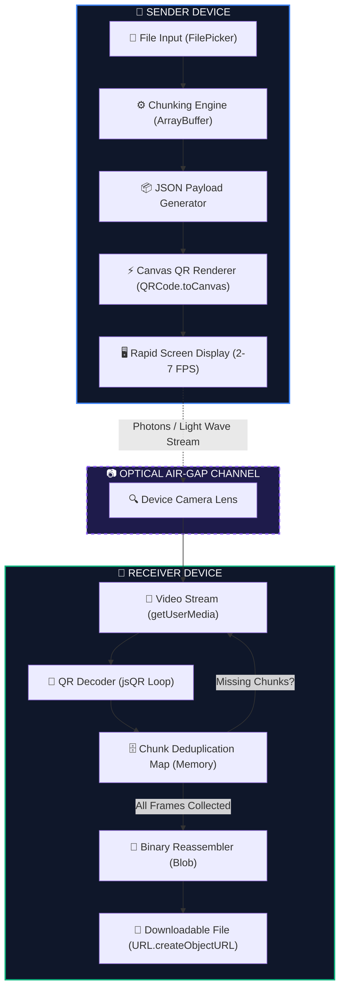
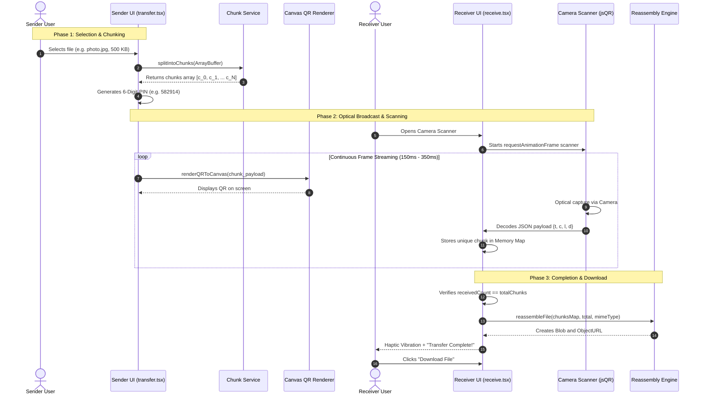
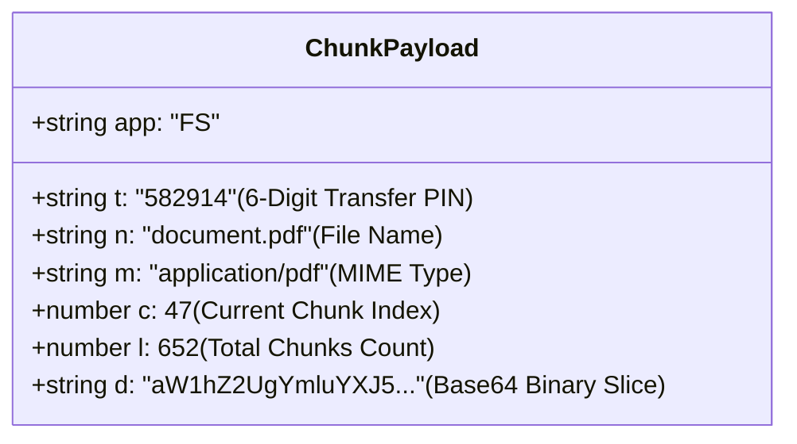

# 📡 FrameShare

> **Share Files, Frame by Frame — 100% Offline via Optical QR Streams.**

FrameShare is a fully offline, air-gapped peer-to-peer file-sharing web application. It transfers files from one device to another using only **animated high-speed QR code streams** on screen and a **camera to scan them** — zero internet, zero Wi-Fi, zero Bluetooth, zero cables, and zero servers.

---

## 🏗️ System Architecture

FrameShare operates entirely client-side inside the browser using modern HTML5 Web APIs and an optical transfer pipeline:



---

## 🔄 How It Works (End-to-End Sequence)

The transfer lifecycle is divided into 4 phases: **Chunking**, **Optical Broadcast**, **Continuous Capture**, and **Reassembly**:



---

## 📦 Optical Protocol & QR Payload Structure

Each QR code contains a lightweight, minified JSON packet designed to maximize payload capacity while minimizing QR code density for lightning-fast camera recognition:



### Packet Field Reference:
- **`app`**: Application identifier (`"FS"` for FrameShare) to ignore irrelevant QR codes.
- **`t`**: 6-digit numeric Transfer PIN to prevent cross-talk between multiple active transfers.
- **`n`**: Original file name with extension.
- **`m`**: File MIME type for correct reconstruction.
- **`c`**: Zero-based chunk index.
- **`l`**: Total chunk count (total frames).
- **`d`**: 1 KB–1.5 KB slice of raw file data encoded in Base64.

---

## ⚡ What Makes It Fast?

1. **Direct HTML5 Canvas Rendering**: QR frames are drawn straight to `<canvas>` via `QRCode.toCanvas()`, eliminating image decode lag and DOM reflow overhead.
2. **Adjustable Optical Speeds**:
   - **⚡ Turbo (150ms / ~6.6 FPS)**: Best for modern smartphone cameras in good lighting.
   - **Fast (250ms / 4.0 FPS)**: Recommended default setting.
   - **Normal (350ms / ~2.8 FPS)**: Balanced for steady scanning.
   - **Slow (500ms / 2.0 FPS)**: For older or low-light cameras.
3. **Full Frame Expansion (⤢)**: Expand the QR code on the sender's device so the receiver can scan easily from a distance.
4. **Playback & Frame Stepper**: Pause on any frame or manually step (`◀` / `▶`) to broadcast a single missing frame directly.

---

## 🚀 Key Features

- **100% Offline & Air-Gapped** — Zero network dependencies, zero telemetry, zero server storage.
- **6-Digit Transfer PIN** — Clean, human-readable numeric code (e.g., `582 914`).
- **Continuous Frame Looping** — Missed a frame during the first rotation? The sender loops automatically until all chunks are collected.
- **Deduplication Engine** — Redundant frames are filtered in $O(1)$ time in memory.
- **Live Progress & Haptics** — Real-time percentage, remaining chunk count, and haptic feedback.
- **Zero Installation** — Runs in any modern mobile or desktop web browser.

---

## 📁 Supported Files

| Type  | Extensions            | Max Size |
| ----- | --------------------- | -------- |
| Text  | `.txt`                | 20 MB    |
| Image | `.jpg` `.jpeg` `.png` | 20 MB    |

---

## 🛠️ Tech Stack

| Layer       | Technology                              |
| ----------- | --------------------------------------- |
| Framework   | Next.js (Pages Router, Static Export)   |
| Language    | TypeScript                              |
| Styling     | Modern Vanilla CSS & Glassmorphism      |
| QR Generate | `qrcode` (Direct Canvas Renderer)       |
| QR Scan     | `jsQR` via `requestAnimationFrame`      |
| Camera API  | `navigator.mediaDevices.getUserMedia()` |
| File I/O    | File API, FileReader, Blob              |

---

## ⚡ Quick Start

### 1. Prerequisites
- [Node.js](https://nodejs.org/) 18+
- npm or yarn

### 2. Install & Run Development Server
```bash
# Clone the repository
git clone https://github.com/your-username/frameshare.git
cd frameshare

# Install dependencies
npm install

# Start development server
npm run dev
```

Open [http://localhost:3000](http://localhost:3000) in your browser.

### 3. Build for Production
```bash
npm run build
```

The production output is completely static and can be deployed anywhere (Vercel, Netlify, GitHub Pages, or local web servers).

> **Note:** Camera access requires `https://` (or `http://localhost`) due to modern browser security policies.

---

## 📱 Step-by-Step Usage Guide

### 📤 Sending a File (Device A)
1. Open FrameShare on **Device A** and tap **Send File**.
2. Select your file (`.txt`, `.jpg`, `.jpeg`, `.png` up to 20 MB).
3. Tap **Start Transfer**.
4. FrameShare generates a 6-digit PIN and begins streaming the QR frames.
5. *(Optional)* Select **⚡ Turbo** or **Fast** for high transfer speeds, or tap **⤢ Expand QR** for full-screen mode.

### 📥 Receiving a File (Device B)
1. Open FrameShare on **Device B** and tap **Receive File**.
2. Tap **Start Camera Scanner** and grant camera permissions.
3. Aim the camera at the QR code stream on Device A.
4. The scanner automatically captures and verifies incoming chunks.
5. When all frames are collected, tap **💾 Save / Download File** to save the reassembled file!

---

## 📄 License

This project is open-source and built for educational and practical air-gap transfer demonstrations.
