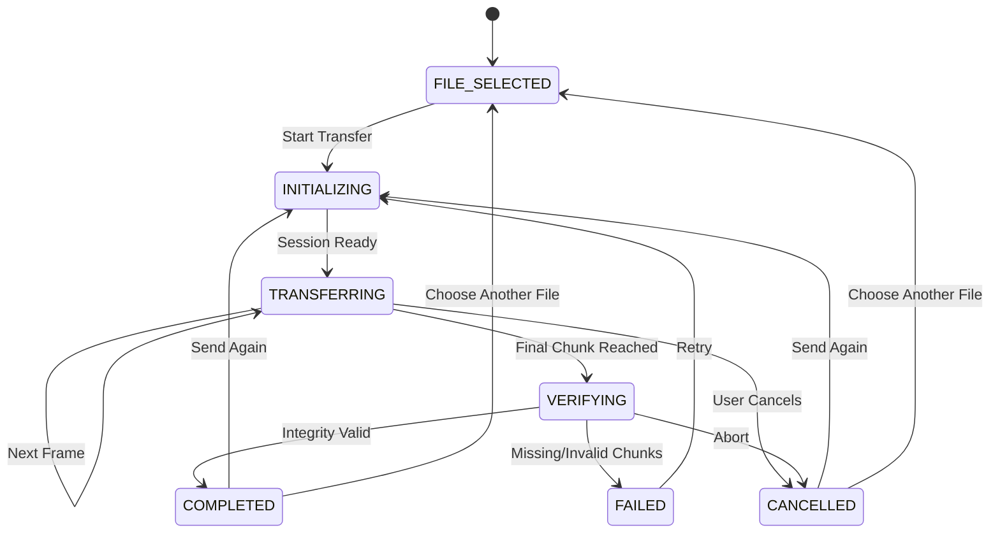
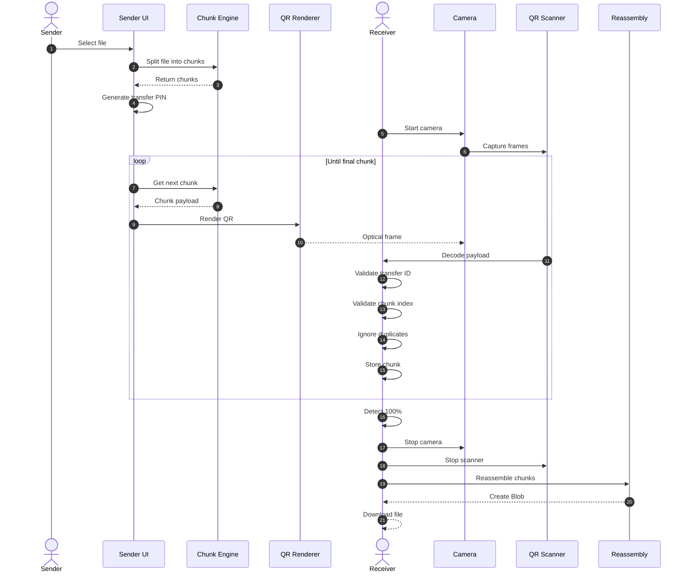

# FrameShare

## Share Files, Frame by Frame

FrameShare is a browser-based, air-gapped peer-to-peer file-sharing application that transfers files between nearby devices using animated QR-code frames.

The sender displays a sequence of QR codes on the screen, while the receiver uses a camera to capture and decode them. File data is transferred optically without using the Internet, Wi-Fi, Bluetooth, cloud storage, or a file-transfer server. Files are processed and reassembled locally in browser memory.

---

## Features

* Optical file transfer using animated QR codes
* No Internet, Wi-Fi, Bluetooth, or cables required
* No cloud or server-side file storage
* Client-side chunk processing
* In-memory file reassembly
* 6-digit transfer PIN
* Duplicate-chunk protection
* Camera-based QR scanning
* Manual payload input
* Transfer cancellation at any stage
* Immediate stop at 100% completion
* Fresh session for every **Send Again**
* Supports modern desktop and mobile browsers

---

## Architecture

```text
                 OPTICAL TRANSFER

       Sender Device                    Receiver Device
             │                                  │
        Select File                        Start Camera
             │                                  │
             ▼                                  ▼
      Read File in Memory                 QR Scanner
             │                                  │
             ▼                                  ▼
       Chunk Engine                    Decode QR Frame
             │                                  │
             ▼                                  ▼
       Base64 Payload                  Validate Payload
             │                                  │
             ▼                                  ▼
       QR Canvas Renderer ─── LIGHT ──► Memory Map
                                             │
                                             ▼
                                         Reassemble
                                             │
                                             ▼
                                          Blob
                                             │
                                             ▼
                                         Download
```

FrameShare does not require a server to store or relay the file.

---

# Transfer Lifecycle



Each transfer has an isolated session and a clear terminal state:

```text
COMPLETED
CANCELLED
FAILED
```

---

# Core Transfer Rules

## 1. Stop Immediately at 100%

When all unique chunks have been received:

```text
receivedCount === totalChunks
```

the receiver enters the verification stage.

The application must immediately:

* Stop the QR scanning loop
* Stop the camera
* Stop frame generation
* Stop scheduling new timers
* Prevent additional frames from being processed
* Reassemble the file
* Create the final Blob
* Provide the download action

No transfer loop should continue after completion.

---

## 2. Send Again

After a completed or cancelled transfer, the sender can select:

```text
Send Again
```

This creates a completely new session.

```text
Previous Session
─────────────────
PIN:      582914
Progress: 100%
State:    COMPLETED

        ↓ Send Again

New Session
───────────
PIN:      731205
Progress: 0%
State:    INITIALIZING
```

The new session must not reuse:

* Previous transfer state
* Partial chunks
* Previous progress
* Old timers
* Old callbacks
* Previous transfer ID

The local file can be reused so the user does not need to select it again.

---

## 3. Complete Cancellation

Cancellation must work at any point:

```text
1%  → CANCELLED
50% → CANCELLED
99% → CANCELLED
```

When the user cancels, the application must:

* Set the transfer state to `CANCELLED`
* Stop chunk generation
* Stop QR rendering
* Stop timers
* Stop `requestAnimationFrame`
* Stop the camera
* Remove active listeners
* Clear temporary transfer state
* Ignore late asynchronous callbacks

A cancelled session must never transition to `COMPLETED`.

---

# End-to-End Transfer



---

# Optical Protocol

Each QR frame contains a compact JSON payload.

```json
{
  "app": "FS",
  "t": "582914",
  "n": "document.pdf",
  "m": "application/pdf",
  "c": 47,
  "l": 652,
  "d": "aW1hZ2UgYmluYXJ5..."
}
```

| Field | Type   | Description               |
| ----- | ------ | ------------------------- |
| `app` | string | FrameShare identifier     |
| `t`   | string | 6-digit transfer PIN      |
| `n`   | string | File name                 |
| `m`   | string | MIME type                 |
| `c`   | number | Chunk index               |
| `l`   | number | Total chunks              |
| `d`   | string | Base64-encoded chunk data |

Example:

```text
Chunk 0 / 652
Chunk 1 / 652
Chunk 2 / 652
...
Chunk 651 / 652
```

The receiver accepts frames only when the transfer PIN matches the current session.

---

# Duplicate Chunk Protection

A camera may decode the same QR frame multiple times.

Therefore, chunks are stored using their index rather than simply appended.

```text
Map<chunkIndex, Uint8Array>
```

For example:

```text
Received:
47
47
47
47

Stored:
47
```

Only unique chunks contribute to the transfer progress.

---

# Cancellation and Race Conditions

Browser operations such as timers, camera callbacks, and `requestAnimationFrame` may execute asynchronously.

For example:

```text
Timer scheduled
      ↓
User clicks Cancel
      ↓
State = CANCELLED
      ↓
Old callback executes
```

The old callback must not restart or continue the transfer.

Every asynchronous operation should verify that:

```text
Current session is active
AND
Transfer has not been cancelled
AND
Session ID is still valid
```

This prevents stale callbacks from affecting a new **Send Again** session.

---

# Local Memory Processing

File processing occurs locally in the browser:

```text
File
 ↓
ArrayBuffer
 ↓
Chunks
 ↓
Base64 Payload
 ↓
QR Frame
```

On the receiver:

```text
QR Frame
 ↓
Decoded Payload
 ↓
Validated Chunk
 ↓
Memory Map
 ↓
Reassembly
 ↓
Blob
 ↓
Object URL
 ↓
Download
```

Temporary resources should be released when a session ends.

```javascript
URL.revokeObjectURL(objectUrl);
```

---

# Speed Modes

| Mode   | Frame Interval | Approx. FPS | Recommended Use                |
| ------ | -------------: | ----------: | ------------------------------ |
| Turbo  |         150 ms |     6.7 FPS | Modern devices / good lighting |
| Fast   |         250 ms |     4.0 FPS | General use                    |
| Normal |         350 ms |     2.9 FPS | Standard conditions            |
| Slow   |         500 ms |     2.0 FPS | Low light / slower cameras     |

Actual transfer speed depends on QR size, camera quality, lighting, display resolution, autofocus, and successful frame decoding.

---

# Supported Files

| Type  | Extensions              | Maximum Size |
| ----- | ----------------------- | -----------: |
| Text  | `.txt`                  |        20 MB |
| Image | `.jpg`, `.jpeg`, `.png` |        20 MB |

These limits are intentionally conservative because optical QR transfer is slower than conventional network-based transfer.

---

# Technology Stack

| Layer           | Technology                  |
| --------------- | --------------------------- |
| Framework       | Next.js                     |
| Router          | Pages Router                |
| Language        | TypeScript                  |
| UI              | React                       |
| Styling         | Vanilla CSS                 |
| QR Generation   | `qrcode`                    |
| QR Scanning     | `jsQR`                      |
| Camera          | `getUserMedia()`            |
| File Processing | File API, ArrayBuffer, Blob |
| Animation       | `requestAnimationFrame`     |
| Deployment      | Static Export               |

---

# Project Structure

```text
frameshare/
│
├── components/
│   ├── QRDisplay.tsx
│   ├── QRScanner.tsx
│   ├── TransferProgress.tsx
│   └── FilePicker.tsx
│
├── pages/
│   ├── index.tsx
│   ├── transfer.tsx
│   └── receive.tsx
│
├── services/
│   ├── chunkService.ts
│   ├── transferService.ts
│   ├── qrService.ts
│   └── reassemblyService.ts
│
├── utils/
│   ├── transferId.ts
│   ├── validation.ts
│   └── memory.ts
│
├── styles/
│   └── globals.css
│
├── public/
├── package.json
├── next.config.js
├── tsconfig.json
└── README.md
```

---

# Quick Start

## Prerequisites

* Node.js 18+
* npm or Yarn
* Modern browser with camera support

## Clone

```bash
git clone https://github.com/sujalkathait93-lab/frameshare.git
cd frameshare
```

## Install

```bash
npm install
```

## Run

```bash
npm run dev
```

Open:

```text
http://localhost:3000
```

## Build

```bash
npm run build
```

---

# Usage

## Sender

1. Open FrameShare.
2. Select **Send File**.
3. Choose a supported file.
4. Start the optical transfer.
5. A new 6-digit PIN is generated.
6. Point the sender's display toward the receiver's camera.
7. Keep the QR stream visible.
8. The transfer stops automatically when all chunks are received.

After completion or cancellation, use **Send Again** to create a fresh transfer session.

## Receiver

1. Open FrameShare.
2. Select **Receive File**.
3. Start the camera scanner.
4. Point the camera at the sender's QR stream.
5. Frames are decoded and validated.
6. Duplicate chunks are ignored.
7. Progress is calculated from unique chunks.
8. At 100%, scanning stops.
9. The file is reassembled locally.
10. Select **Save / Download File**.

---

# Security

FrameShare does not send file contents to a cloud storage service or file-transfer server.

However, the QR stream is visible to anyone who can see the sender's screen.

The 6-digit transfer PIN provides **session identification**, not encryption.

For stronger confidentiality, client-side encryption should be added before the file is divided into chunks.

All received payloads should also be validated for:

* Transfer ID
* Chunk index
* Total chunk count
* Payload size
* MIME type
* Malformed data

---

# Limitations

QR-based optical transfer has several practical limitations:

* Slower than Wi-Fi, USB, Bluetooth, or WebRTC
* Large files require many QR frames
* Poor lighting can reduce decoding accuracy
* Camera autofocus affects reliability
* Sender and receiver must maintain visual alignment
* Browser camera permissions are required
* Camera access depends on browser security requirements

---

# Design Principles

FrameShare is built around five principles:

```text
1. Local First
2. No File Server
3. Isolated Transfer Sessions
4. Immediate Cancellation
5. Stop Exactly at Completion
```

The transfer engine must not continue running after a session reaches a terminal state.

---

# Development Checklist

* [ ] New transfer ID for every session
* [ ] Progress starts at 0%
* [ ] Duplicate chunks are ignored
* [ ] Invalid payloads are rejected
* [ ] Sender stops at the final chunk
* [ ] Receiver stops scanning at 100%
* [ ] Camera tracks are stopped
* [ ] Timers are cleared
* [ ] Animation frames are cancelled
* [ ] Cancellation works at any progress
* [ ] Cancelled sessions cannot become completed
* [ ] Old callbacks cannot modify new sessions
* [ ] Send Again resets progress
* [ ] Send Again generates a new transfer ID
* [ ] Partial chunks are not reused
* [ ] Object URLs are revoked
* [ ] Temporary memory is released
* [ ] File contents remain local
* [ ] Reassembled file matches the original

---

# License

FrameShare is open-source educational and practical software demonstrating browser-based optical data transfer and air-gapped file-sharing concepts.
