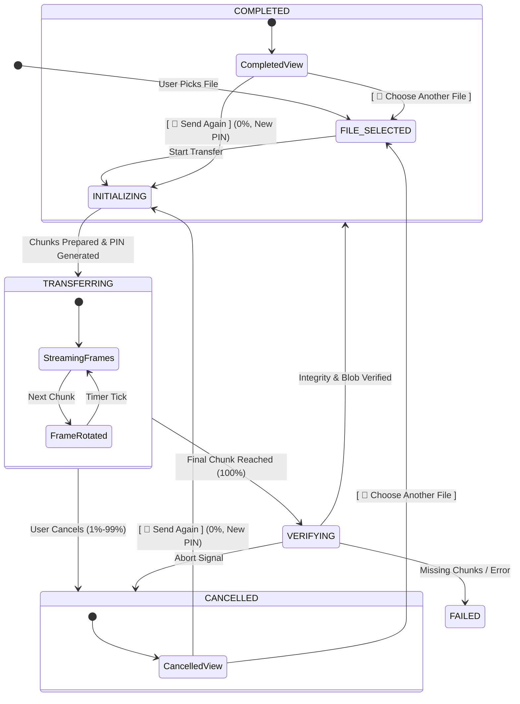
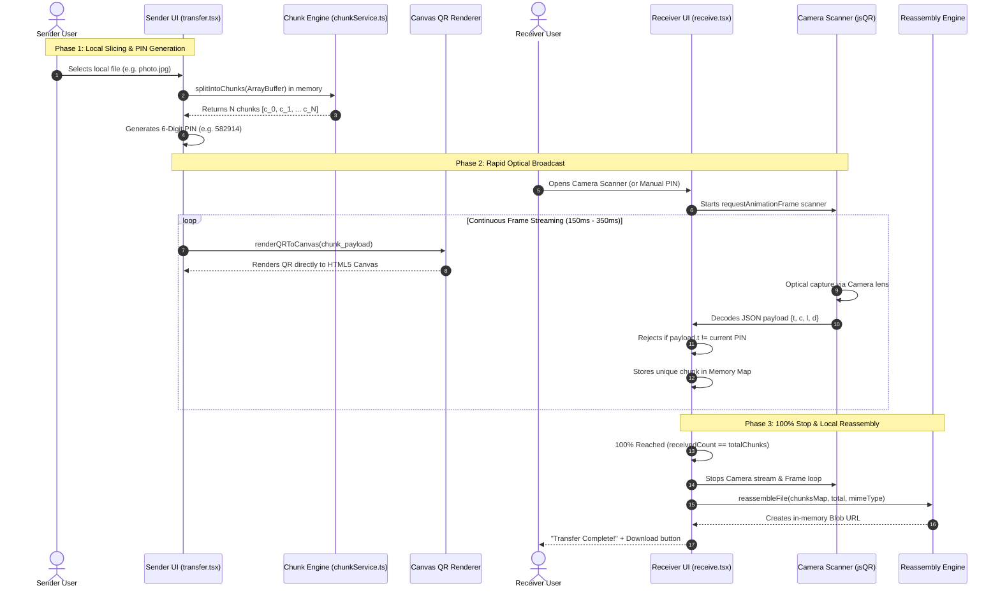
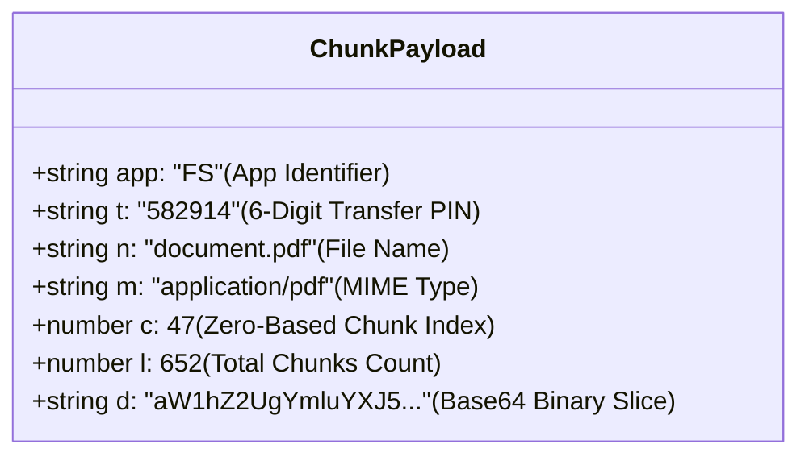

# 📡 FrameShare

> **Share Files, Frame by Frame — 100% Offline via Optical QR Streams.**

FrameShare is a fully offline, air-gapped peer-to-peer file-sharing web application. It transfers files from one device to another using only **animated high-speed QR code streams** on screen and a **camera to scan them** — zero internet, zero Wi-Fi, zero Bluetooth, zero cables, and **zero server storage**.

---

## 🔒 Core Guarantees & Architecture

### 1. 🛑 100% Means STOP — No Infinite Chunk Processing
* When the transfer reaches 100% (final chunk $N/N$), chunk generation and transmission terminate **immediately and completely**.
* No background retry loops, timers, or duplicate frame generators run after completion.

### 2. 🔁 Instant Reuse / "Send Again"
* After a completed or cancelled transfer, users can tap **`[ 🔁 Send Again ]`** to send the exact same selected file without picking it from disk again.
* **Fresh Session Isolation:** "Send Again" creates a brand new `transferId` (6-digit PIN), resets progress cleanly to 0%, and never resumes from partial progress or leaks old session state.

### 3. 🛡️ Complete Cancellation & Race Condition Protection
* Cancelling at 1%, 50%, or 99% stops all camera feeds, chunk generation, and memory listeners instantly.
* A cancelled transfer can never transition to `COMPLETED`.

### 4. 🗄️ Zero Server Storage
* **Zero Persistence:** No file contents, chunks, ArrayBuffers, or Blobs ever touch a server, database, or disk log.
* **Client-Only Reassembly:** The receiver reconstructs files strictly in local browser memory (`Blob` + `URL.createObjectURL()`) and frees memory on session reset.

---

## 🏗️ State Machine Lifecycle

FrameShare enforces a deterministic state machine for both the Broadcaster (Sender) and Scanner (Receiver):



---

## 🔄 How It Works (End-to-End Optical Pipeline)



---

## 📦 Optical Protocol & QR Payload Schema

Each QR code holds a lightweight, minified JSON packet designed to minimize QR density for instant optical recognition:



---

## ⚡ Speed Modes & Controls

| Mode | Frame Interval | Effective FPS | Recommendation |
| :--- | :--- | :--- | :--- |
| **⚡ Turbo** | `150ms` | ~6.6 FPS | Modern smartphones & high-res cameras |
| **Fast** *(Default)* | `250ms` | 4.0 FPS | General high-speed transfers |
| **Normal** | `350ms` | ~2.8 FPS | Standard scanning speed |
| **Slow** | `500ms` | 2.0 FPS | Low-light environments & older cameras |

---

## 📁 Supported Files

| Type  | Extensions            | Max Size |
| ----- | --------------------- | -------- |
| Text  | `.txt`                | 20 MB    |
| Image | `.jpg` `.jpeg` `.png` | 20 MB    |

---

## 🛠️ Tech Stack

| Layer       | Technology                              |
| ----------- | --------------------------------------- |
| Framework   | Next.js (Pages Router, Static Export)   |
| Language    | TypeScript                              |
| Styling     | Botanical / Organic Serif (Vanilla CSS) |
| QR Generate | `qrcode` (Direct HTML5 Canvas Render)   |
| QR Scan     | `jsQR` via `requestAnimationFrame`      |
| Camera API  | `navigator.mediaDevices.getUserMedia()` |
| Memory I/O  | File API, FileReader, Blob              |

---

## ⚡ Quick Start

### 1. Prerequisites
- [Node.js](https://nodejs.org/) 18+
- npm or yarn

### 2. Install & Run Development Server
```bash
# Clone the repository
git clone https://github.com/sujalkathait93-lab/frameshare.git
cd frameshare

# Install dependencies
npm install

# Start local server
npm run dev
```

Open [http://localhost:3000](http://localhost:3000) in your browser.

### 3. Build for Production
```bash
npm run build
```

---

## 📱 Usage Guide

### 📤 Sender Flow (Device A)
1. Tap **Send File** and select a file (`.txt`, `.jpg`, `.jpeg`, `.png`).
2. Tap **Start Optical Transfer →**.
3. Point the streaming QR code toward the receiver.
4. If cancelled or completed, tap **`[ 🔁 Send Again ]`** to start a fresh transfer session with the same file.

### 📥 Receiver Flow (Device B)
1. Tap **Receive File**.
2. **Optical Mode:** Tap **Start Camera Scanner** and point at Device A.
3. **Manual Mode:** Switch to **Transfer PIN / Paste** tab to enter the 6-digit PIN or paste frame payloads.
4. When 100% is reached, tap **`[ 💾 Save / Download File ]`**.

---

## 📄 License

Open-source educational and practical air-gap transfer software. Zero server storage guaranteed.
